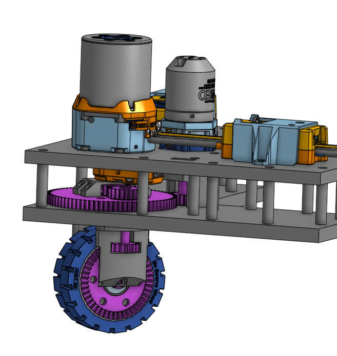

# pancake

Pancake bot.

CAD drawing can be found [here](https://cad.onshape.com/documents/24af23b84924bcae2e494b27/w/7822e903a0ddc4106c8a2e95/e/12f5b05b2e40a2d157e12141).

*final robot*

## What is this?

This is a robot based on a "swerve" drivetrain as seen in FIRST Robotics Competition (FRC). The goal
of the project is to build a robot from the ground up, with the only caveat being that off-the-shelf
FRC parts are used exclusively for motors and electrical systems.

A characteristic of the swerve drivetrain is that the robot can move in a linear direction and
rotate at the same time. This is achieved through independent motion of all "modules" - a "module"
controls the motion of one wheel. Each module has the capability to both orient its wheel
independently all of the other wheels and also drive the wheel at the same time. This works with the
use of 2 motors per wheel - one which drives the speed of the wheel, and one which controls the
angle at which the wheel applies force. As a result of this design, my robot is able to move in a
linear direction and rotate concurrently.

Instead of using a roboRIO as robots in FRC do, this project uses a Raspberry Pi. I chose this in
order to build my own tech stack, instead of depending on the robot control systems that are
pre-built for FRC. I also used a single-board computer such as this in order to use low-level APIs
such as CAN without relying on vendor libraries to control motors and such.

This robot is not FRC-legal. The main component which disqualifies it is the custom tech stack which
I wrote on top of ROS and the Raspberry Pi.

## But why?

I started this project to create a deeper understanding of the process of designing and building a
robot. When starting on my local FRC robotics team, I was confined to the bubble of the programming
sub-group. I used this project to break out of that bubble and engage in more aspects of the
process, such as CAD, electrical systems, mechanical assembly, and the interface between user-space
robot code and electrical I/O.

I chose the object of just recreating a swerve drivetrain because it was a complex idea that would
produce a cool result. I had an intuition for how it worked when I was just working on the team, but
I wanted to find out for myself how easily it was implemented and what concessions had to be made
for practicality.

## How?
### Spinning a motor
#### CAN interface

In FRC, CAN is the primary protocol with which the roboRIO interfaces with motors. The Raspberry Pi
does not come with a native CAN interface, in contrast to the roboRIO's built-in CAN ports. With
this being said, however, commercial auxiliary CAN hats can extend the Raspberry Pi's hardware
functionality through the use of the Raspberry Pi's
[SPI](https://en.wikipedia.org/wiki/Serial_Peripheral_Interface) interface, and provide a CAN
network exposed to user-space Linux programs, such as my robot code.

#### SOLO

I chose a Raspberry Pi to control the robot for several reasons. It's cheap, supports a widely-used
operating system, runs on very little power (<1 amp @ 5V), and it does not require an SDK or
specialized development environment to develop for it. While researching the requirements for this
project, however, it was very difficult to find any motor controllers that fell within the budget of
this project while also being guaranteed to work on any CAN-supported computer.

The best candidate I could find that fit both of these criteria was
[SOLO Motor Controllers](https://solomotorcontrollers.com), based out of Europe. Specifically, their
UNO v2 controller with its 45A max current. The only issue was that one controller costed 239 euros
(around 278 USD). Despite the cost, however, this was still the cheapest option that was not
confined to a proprietary ecosystem. I ordered 2 controllers for testing and development purposes so
that I could design and build a module while waiting for more to arrive.

SOLO controllers communicate with their controlling devices via CANopen, among other supported
protocols. I decided to stick with a CAN protocol due to its proliferation in FRC. SOLO provides
a library in both Python and C++ to communicate with their controllers. I was drawn to using their
C++ API due to my familiarity with native programming. However, the C++ library was written locked
to Windows, and my device of choice was running a distrobution of Linux. It's not very feasible to
install Windows on a Raspberry Pi, nor was embedding Windows an attractive option from a familiarity
perspective. I had an Intel Nuc that I had installed Windows on, however it was not common to attach
a CAN interface to a computer through USB, and I was also just aversed to Windows. I had already
bought a CAN hat for the Raspberry Pi, so the Python API seemed like my best option, as
uncomfortable as I was with the language.

#### NEO Vortex & NEO 550 motors

The most common type motor in FRC is **brushless DC** (BLDC). These motors generally have high
torque and top speed. Initially, I planned to drive both the wheel's speed and orientation using the
same kind of motor, the [NEO Vortex](https://revrobotics.com/rev-21-1652) from REV Robotics. I chose
this motor because it has a relatively high stall torque, and it is widely used in FRC.

This motor is designed to work with either a [SPARK Flex](https://revrobotics.com/rev-11-2159)
controller or a [Solo Adapter](https://revrobotics.com/rev-11-2828) together with a
[SPARK MAX](https://revrobotics.com/rev-11-2158) controller. Due to my previous initial decision of
using a SOLO controller, I decided to buy 2 of both Vortex motors and Solo Adapters. Before I did
this, however, I emailed REV Robotics to verify that a Solo Adapter would work with a generic BLDC
motor controller, to which they affirmed yes. With their confirmation, I ordered the motors and
adapters.

When the Vortex motors and SOLO controllers arrived, I decided to wire one set up for testing.
I assembled the motor onto the Solo Adapter, connected the three phase wires to the SOLO controller,
and and powered the SOLO controller with an oscilloscope power supply. However, I also needed to
connect the internal encoder to the controller. The encoder allows the computer to receive feedback
from the motor about how fast it's moving, and how much it's moved since it was powered on. I cut
the 6-pin JST encoder cable that came with the Solo Adapter to half length, and soldered it to the
smaller-pitch 6-pin JST cable, using mappings for the cable found on
[REV's docs](https://docs.revrobotics.com/brushless/spark-max/specs/encoder-port) and the UNO v2
[user manual](https://solomotorcontrollers.com/wp-content/uploads/materials/SOLO_UNO_v2_SLU0722_5832_UserManual.pdf).
This allowed me to spin the motor through the controller's UART interface.

When I began designing the module, I realized that for module azimuth, I did not need
nearly as much torque AND speed as the Vortex provided. In order to minimize both power usage and
project cost, I replaced the azimuth motor with a [NEO 550](https://revrobotics.com/rev-21-1651)
motor in my design, and ordered one motor. I also connected the motor to a set of gearboxes which
decreased its gear ratio by 1:12, increasing its torque while decreasing the speed at which the
wheel rotates in relation to the motor's speed. This can be easily accounted for in code.

#### SPARK MAX

As I was noticing the corner of unfamiliarity I was backing myself into with my developing tech
stack, I decided to send an email to REV Robotics concerning the API for their proprietary motor
controller, the SPARK MAX. I was familiar with this controller due to my experience programming on
an FRC team. This seemed like an amazing alternative to SOLO due to its much cheaper cost of 90 USD.
I asked if there was a library for desktop development environments that I had missed for
communicating with their motor controllers, or if they could provide me with the CAN protocol details
if they did not have such a library published. To my surprise, they sent me a spreadsheet describing
the details of SPARK MAX CAN frames. This gave me a viable alternative to the much more expensive
SOLO controllers.

After careful consideration, I decided to substitute the SOLO controllers for SPARK MAXs. I scrapped
the Python code that I had written to communicate with the controllers, and I ordered 1 SPARK MAX,
learning from my mistake previously of ordering 2 controllers to test. It was also convenient that
the controllers shipped from the US, rather than Italy.

As I now had to write my own API for CAN communication, I was able to write my new stack in a
language I was more familiar with. With Python off the table, I was opting towards C++. I briefly
considered Java, being both the most common language in FRC and also the language that my team works
in. However, I would need to waste time working with the Java Native Interface, communicating
directly with the Linux kernel. This seemed like too much of a hassle in a language that was both
abstracted from low-level APIs and not my language of choice, so I decided to stick with my comfort
language: C++.

CAN on Linux works by opening a socket on the `canX` network, with `X` being the interface index.
This allows one to send CAN frames on the electrical CAN network via the ubiquitous Linux socket
API. Through Googling I came across this great
[document](https://kernel.org/doc/Documentation/networking/can.txt) which describes how the socket
CAN interface is used. This greatly sped up the software development process.

There are many protocols through which functionality is exposed over CAN. The most common one by far
is CANopen, which is used in industry robotics and medical equipment. FRC, however, has
[their own CAN protocol](https://docs.wpilib.org/en/stable/docs/software/can-devices/can-addressing.html).
Even so, this specification does not explain on its own how to communicate with one specific kind of
motor controller. This in combination with the spreadsheet that REV support shared with me made it
possible for me to begin working on my own library to communicate with SPARK MAX controllers.

After much writing, debugging, and emailing, I was able to write my own vendor library to control
DC/BLDC motors through SPARK MAX controllers. However, REV stipulated that I cannot share the
details of the CAN spec, so the `vendor/librevfree` submodule (the library that I wrote to interface
with the motor controllers) is not made public.

I had issues with motor controllers later down the road. Accordingly, I continued to commit to the
library as I was developing the robot. It's very hard to write your own library and use it without
finding issues.

### Software development

FRC relies upon a proprietary control system integrated with an NI roboRIO. It sends signals through
the control client to dictate which WPILib routines run on the roboRIO ("Teleop" or "Autonomous")
during various phases of each FRC match. It also handles controller input during the teleoperated
mode to allow the user to control the robot directly.

As I was operating in my own development environment, I had none of these luxuries. I had to choose
how exactly I wanted to design my robot system.

#### Communication via ROS & Docker

Because this project uses a Raspberry Pi, I needed some way to communicate with a control system. I
used ROS (**R**obot **O**perating **S**ystem) to achieve this. ROS is a tech stack designed for
interoperation between multiple processes running either on the same computer or multiple in a
closed system. It natively supports C, C++, and Python, which fit any conceivable use case I had for
it in this project. 

An ROS application consists of a system of "nodes," individual processes on various devices which
send arbitrary messages to each other. The ROS message system is identical to FRC's
publisher/subscriber system, where server nodes send messages on "paths" akin to Unix file paths for
client nodes to listen to.

ROS is not natively supported on any Linux distributions other than Ubuntu. The Raspberry Pi only
directly supports its own version of Debian called Raspberry Pi OS, or Raspbian. Although Ubuntu is
closely related to Debian through its package manager and source tree, the two distributions use
different package repositories, and for the robot's runtime environment, I wanted the package
manager system to be as clean as possible, without any hacked-together package manger configuration.

I considered installing Ubuntu on the Raspberry Pi that I mounted onto the robot, however Docker
seemed like a much better choice. Docker is a background process that runs containerized versions of
operating systems pre-installed with a desired program. It's useful for "shipping" the *exact*
runtime environment that you want your program to run in. With Docker, I could control explicitly
for the runtime environment of my project using my custom-built Docker image.

Docker also allows the image to have controlled access to the host computer's peripheral devices.
This includes the CAN network and game controllers. Passing through the host networks and input
devices, I was able to precisely control the methods in which my program could interact with its
host environment. This is very useful for creating security sandboxes, minimizing the chance that a
vulnerability in my tech stack could compromise my workflow and the end product.

Deciding to ship my software stack with Docker, I set up a Docker build in my code tree. As I was
hosting my project's code using a private Github repository, I had limited monthly access to Github
Actions, their CI/CD system, a service which runs automated tasks when it receives events. My access
was limited by job run time, however my builds were infrequent enough that I was able to build the
Docker image for both x86 and ARM architectures every time that I pushed a commit. As I used CI/CD
more frequently, and I wanted to control the hardware that it was built on, I began using a desktop
computer installed with an Ubuntu server to act as an Actions runner for my project, lifting the
usage restrictions.

#### Cross-compilation

Single-board computers such as the Raspberry Pi run on the ARM CPU architecture. This differs from
the x86 architecture that most desktop, laptop, and data center machines run on. However, because I
was developing the project in C++, and the native Linux ELF binaries that C and C++ compile to
cannot run on architectures they were not compiled for, so I was forced to compile my ROS project
explicitly for `arm64`. Initially, I emulated the `arm64` architecture during the Docker build via
QEMU in my CI/CD workflow. However, each build took around 30 minutes due to the compiler overhead
introduced with C++ templating, and the proliferation of templates in the ROS C++ client library.

The more efficient approach I devised was to segment the Docker build into two stages: `build` and
`runtime`. The `build` stage runs on the native architecture of the compilation machine, while the
`runtime` stage runs on the target architecture that the image will be built for. The project is
cross compiled in the `build` stage using compiler wizardry and
[shell scripts](scripts/buildenv.sh). After this, the binaries are copied into the `runtime` stage,
and the robot code can run natively on the Raspberry Pi through the Docker hypervisor.

#### Robot input & SDL

FRC uses conventional game controllers to control competition robots. The most common controllers
used are those of the Xbox 360, Xbox One, and PS4. These controllers are all supported by
[SDL](https://github.com/libsdl-org/SDL), a library for GUI applications with real-time input,
designed for applications such as game development. As I was already familiar with the library's
usage, I decided to use this library to handle controller input on the robot. It can be built
headless (without windowing support) using a configuration flag (`-DSDL_VIDEO=OFF`) so that it
builds in less time without unnecessary features.

I used SDL in an independent `client` ROS node to handle controller input from the user, and pass
messages along to the `robot` node. I also wrote a simple GUI client in the same `client` node using
[Dear ImGui](https://github.com/ocornut/imgui) in case the library was built with video support,
i.e. in desktop environments for simulation and remote control.

#### Drivetrain control

The main meat and potatoes of my application is in the `swerve` ROS node. Receiving messages from
its controlling `robot` node, it derives motor voltages from the `robot` node's "request" using
geometric, trigonometric, and physical principles. It then sends CAN messages to the SPARK MAX motor
controllers, which use their respective motor to produce torque on that motor's axis.

After it sends signals to its motors, it then uses the feedback of velocities reported by
aforementioned motors' encoders to determine the current velocity of each module. The data collected
on each module is then uses to determine the linear and angular velocity of the entire robot in
order to inform how it continues to control each module. All of this data is published back to the
ROS message system for the `robot` and `client` nodes to use.

#### Self-updating & bluetooth controller pairing

I wanted this project to have the capability to run without any external computers or monitors. For
this purpose, I wanted to expose two helpful functions on the actual chassis of the robot:
self-updating and controller connection.

Due to the containerized nature of this project through Docker, new versions are easily installed by
downloading a new image and recreating the container using the newly-downloaded image. Because of
the simplicity of this process, a project called
[Watchtower](https://github.com/containrrr/watchtower) exists to automate it. With an option, it
exposes an HTTP REST API which allows clients to send HTTP requests to trigger container updates.

I wrote another containerized [program](https://github.com/heyallnorahere/robot-util) to expose this
functionality through a text UI on a small $10 20x4 HD44780 I2C LCD screen. It handles automated
image updates through a menu option which is selectable through a rotary encoder connected to the
Raspberry Pi's GPIO pins. I wrote this program in C both to stretch myself with a minimalist
programming language and because the program itself was not inherently object-oriented as the swerve
drivetrain was. It's containerized with Docker similarly to the actual robot code, and self-updates
through the same mechanism through which it updates the robot code.

I also created menu functionality to pair bluetooth devices. This is useful for pairing console
controllers, as oftentimes these controllers connect to their respective console through bluetooth.
This allows one to pair a controller to control the robot through the LCD screen, instead of having
to `ssh` into the Raspberry Pi and pair it manually through `bluetoothctl`.

### Chassis design

As the goal of this project was to gain experience with all aspects of robot design, I designed the
entire robot chassis from the ground up. In FRC, it is standard practice to buy manufactured swerve
modules from hardware vendors (i.e. REV, Swerve Drive Specialties), as the drivetrain is not the
primary hurdle of robot development. However, my focus was primarily on the intricate design process
of the *entire* robot, including the swerve modules. These were the first step in robot development.

#### CAD

Before this project, I had acquired some CAD (**c**omputer-**a**ided **d**esign) experience. In the
past, I had designed some robotics-adjacent projects with CAD software, however these projects never
came to fruition. This project seemed like a perfect opportunity to brush up on my CAD skills.

The software suite that I chose for this project was Onshape. Onshape is very commonly used in FRC
design teams, and I had used it in the past with physically-designed projects. It's also very
feature-complete with an extensible API for creating additional features.

#### Materials

The vast majority of mechanical parts in FRC are manufactured out of aluminum. During development, I
did not have access to a CNC router, so I chose the next best option, which I had plenty of
experience with: 3D printing. 3D printers can manufacture parts with plastics of varying tensile
strengths, which gave me confidence in the approach.

For parts such as gears that experience large amounts of force over very little surface area, I
decided to print with ASA (**a**crylonitrile **s**tyrene **a**crylate) filament, a thermoplastic
commonly used in the manufacturing of mechanical parts. However, as I was prototyping with PLA
(**p**oly**l**actic **a**cid) infused with ABS (**a**crylonitrile **b**utadiene **s**tyrene), I
found that parts printed completely filled with plastic held up very well under simulation of the
stress that they would experience. Drawing from this discovery, I decided to manufacture all parts
used in the swerve modules and electronics mountings with this blend of PLA and ABS.

I assembled the modules to the rest of the components using custom-cut 20x20 aluminum extrusions.
These were preferable to long, segmented 3D printed parts because the alternative would not be
nearly as structurally stable, nor would it be time- or cost-effective in comparison to extrusions.

#### Structure

Due to the flexibility in which one can design parts for 3D printers, and the availability of
breakaway support material, designing the structure itself was trivial. Each module consists of two
main plates, supported between each other with 3cm-long printed standoffs. 3D-printed parts are
extremely strong under compression, which led me to use them as nothing more than spacers, held in
place by M3x50 bolts on the top and M3 nuts on the bottom.

As the large majority of the module's weight lies on the top plate, it's very important that it's
adequately supported. With some quick Googling, I determined that PLA plates should be supported
roughly every 5cm. I shortened this slightly to 4.2cm both for convenience in my design and to
create a margin for printing and assembly error.

#### Hardware

Wherever possible, I stuck with metric units and bolt sizes. I had quite a lot of M3 hardware lying
around, so I used M3 whenever I could. However, I had to make some exceptions. To secure the two
internal drive gears to their respective shafts, I used an M2 bolt threaded through a nut in a small
pocket on the internal circumfrence of the gear. M3 screws were too large. In my mount for the
Raspberry Pi, I had to use M2.5 bolts to fit through the RPi's mounting holes. Additionally, all
FRC-legal parts use #10-32 bolts. In addition to the irritation of using imperial units, I did not
have any #10-32 hardware in stock.

I mounted each individual part onto the aluminum extrusions which joined the chassis together with
drop-in M3 T-nuts. On the uncut extrusions which I already had in stock, the T-nuts dropped in
perfectly. However, when the custom-cut extrusions I ordered from Misumi arrived, the lips on the
new extrusions did not allow the T-nut to drop in. This created a slight inconvenience whenever I
added a new part to the chassis, as I had to remove the entire extrusion from the chassis and slide
the necessary quantity of T-nuts down the shaft.

#### Design details

For a reference of how swerve modules commonly work, I at the CAD drawing for
[REV's MAXSwerve module](https://revrobotics.com/rev-21-3005/). As a result, the module was loosely
based off of this design. I also used their wheels in my design.

The module uses two motors in coordination to orient and drive the wheel independently. The module
is also fitted with a duty cycle encoder to measure the distance from the module's "default"
position. This allows the motors to control the direction and magnitude of force which the module
is exerting on the robot's chassis while also sending feedback to the robot's controlling device.

The drive motor has a nearly inconsequential gear ratio because the motor produces a large amount of
torque on its own. However, I attached two gearboxes to the rotational motor to decrease its gear
ratio by 1:12. This is further decreased by its 1:4 relation to the output orientation of the wheel,
which leaves the axis with a gear ratio of 1:48 to maximize torque.

*CAD drawing of swerve module*

### Electronics

Robots need power. A lot of power.

#### Power delivery

FRC robots run on a nominal voltage of 12 volts. Typical SLA (**s**ealed **l**ead **a**cid)
batteries as used in FRC generally produce a voltage slightly higher, at 13 volts. To mimic the
final environment of an SLA battery, I ran motors on a 13V wall power supply while prototyping.
However, when I attached the modules to a full chassis, I began running the robot off of battery
power.

The battery is fed into a 120A breaker, common in FRC robots. This creates a hard upper limit for
the robot's power draw, mitigating the damage of short circuits and stalled motors. It also provides
a switch to turn the robot on and off immediately, a safer mechanism than simply attaching the
battery.

All power in the robot runs through a centralized device called a PDH (**P**ower **D**istribution
**H**ub), another FRC-standard component from the vendor of the motors and controllers I was using,
REV Robotics. It distributes power to multiple channels, each limited with a fuse or breaker. The
PDH was also ideal for testing and iteration, with WAGO clips on each channel for both VCC and
ground, as opposed to permanent crimping or soldering. The battery cables from the breaker run
directly into the PDH, where it distributes power and limits current draw from each motor.

I used 12AWG wire to connect the motor controllers to the PDH. 12AWG wire is rated for 20A
continuously, with a fusing current of over 200A. This was ideal for my application, as the maximum
current between both kinds of motor was 45A, and the force required to move the robot was not
particularly high. These wires were connected to the motor controllers with WAGO connectors,
similar to the PDH terminals.

#### Cable management

Due to the mobile nature of this project, I needed to organize cables very neatly to avoid snagging
on any variation in the surface on which it's driving. Wires snagging on external objects could
cause power loss and short circuits, which at 12 volts could potentially cause significant damage to
the robot and its environment.

To simply cable management, I used paired red and black 12AWG cable to deliver power to the motor
controllers. I also ran cables along the 20x20 extrusions of the chassis' frame to avoid a rat's
nest in the empty portions of the frame.

I initially considered zipties to fasten cables to the extrusions. However, these are very wasteful,
with any electrical change creating plastic waste in the form of the previous tie. Because of this,
I chose to use velcro cable ties, reusable organizational ties which fulfill the same purpose as
zipties.

## Overarching challenges

**Lack of documentation**. I initially chose SOLO controllers because SPARK MAX controllers,
although clearly the better alternative, did not have publicly available CAN documentation. Even
after emailing REV, and working with a spreadsheet of CAN IDs, I still struggled to piece together a
viable control library. I had to decompile the native roboRIO REV library with
[Ghidra](https://github.com/NationalSecurityAgency/ghidra) to find memory layouts for status frames
undocumented in REV's spreadsheet. Additionally, as the new FRC season started in January 2025, REV
released a new version of firmware which dramatically changed the CAN API. After struggling to find
any data related to this new firmware version, either through REV support or in decompiled C++ code,
I opted to use an older version of the controller firmware.

**Iteration times**. C++ code that includes ROS headers took significantly longer to build and
therefore iterate upon due to the prominent use of templating within the library. I mitigated build
times by optimizing the build process (i.e. building image on native architecture, minimizing header
inclusion in code), however each build of my robot code took around 10 minutes. Additionally, when
designing the robot in CAD, I made several mistakes in designing each part. Most parts in each
module on either the module's top or bottom plates, and so a part change often meant I had to
re-print one or both of the plates. Each plate took slightly less an hour to print, so at the worst,
one print to fix one part took upwards of 2 hours. This combined with reassembly time
dramatically slowed the build process.

**Module mounting**. The module was just slightly too thick between the top surface of the top
plate and the bottom surface of the bottom to mount onto aluminum extrusions on the bottom of the
module with M3x50 bolts. M3x60 bolts were slightly too long to create a strong connection between
the module and the robot frame, and M3x50 bolts had to be forced into the T-nuts on the bottom. To
solve this issue, I ordered non-standard M3x55 bolts, which cost significantly more than M3x50s or
M3x60s and took nearly a week to arrive after I realized the issue, however they were able to create
a strong mechanical connection when suspended above the bolt's counterbore slot with a washer.

**UltraPlanetary bolt snugness**. The azimuth motor's output is fed through two REV UltraPlanetary
gearboxes which decrease its gear ratio by 1:12. These gearboxes are fastened to the module and
motor using 6 M3x30 bolts fed straight through the gearboxes into the motor. The issue with this
design arises when the bolts are fastened too tightly, and the friction of the system increases
dramatically. However, when the bolts are not fastened tightly enough, the motor begins shifting as
torque is applied, damaging the motor over time. Additionally, the bolts loosen very easily. I
solved this issue by using locktite to lock the bolts in place relative to the motor, gearboxes,
and module.

**Module inversion**. As I was preparing to test the robot moving on the ground, I noticed that two
modules were spinning inverted from the direction they should have been spinning in. This bug took
me 4 days to fix, and was caused by three main things. I had confused the spaces in which the wheel
well was rotating. I had also normalized an angle incorrectly, leading to incorrect angle values
when performing math to determine in what direction each module should be spinning. Fixing these two
issues fixed one module's rotation, however one was still spinning in the wrong direction. This was
ultimately caused by the duty cycle encoder being calibrated in the opposite direction, which was a
simple human error. Fixing this final issue removed this roadblock.

**Ubuntu package versions and ROS cross-compilation environment**.
[ROS does not support native cross-compilation on the latest distribution.](https://github.com/ros-tooling/cross_compile)
Setting up a cross-compilation environment manually is black-magicky, installing multiple
architectures of the same development package onto the same "machine" (or in this case, image build
container). The Python development libraries a prime example of this, breaking each other when
package versions differ. Unfortunately, the ROS image has this installed by default for the build
architecture, and attempting to uninstall it in the container will uninstall the rest of ROS.
Additionally, the Python package in the x86 repository generally gets a version bump a day or two
before the `arm64` port repository. This makes cross-compilation impossible for the amount of time
the two versions differ, because the `arm64` version is not installable without the entire
uninstallation of ROS. Thankfully, this was only an issue once in the development process.

## What went well?

**Final product fit within original project parameters**. The overall design of the robot did not
differ from my original vision when starting the robot. Originally, I was going to use SOLO
controllers, but I switched to SPARK MAX controllers before mechanically designing the robot in CAD,
so no major reworks needed to be done.

**FRC skills**. As one of the main stated goals when starting this project, I made sure to design
the robot as similarly to an FRC bot as I could. This led me to design the robot from the ground-up
as somebody on the design team would; I connected and organized CAN, power, and encoder wires as one
on the "systems" team would do; and I assembled the robot from the ground up, gaining me experience
with the "mech" team process. I also had the opportunity to delve into the FRC-flavored CAN
protocol, which is a step up from my previous experience on the programming team.

**No major electrical mistakes**. Even though it takes a large voltage to send a dangerous current
through the human heart due to the resistance from the end of one arm to the other, short circuits
directly between battery leads are potentially very dangerous. For this reason, I kept all wires
under fuses when possible, and I kept the PDH unplugged from power while managing wires. Because of
this, I never had any major electrical incidents while working on the robot. The only mistake that I
made in this regard was a particularly unfortunate accident when I sent a static shock through the
CAN hat of the Raspberry Pi and fried the board with a short. The Raspberry Pi was not harmed at
all, however I had to replace the CAN hat which cost $60 and a week.

**Communication protocol**. ROS supplies a robust real-time communication framework for coordination
between ROS nodes. This allowed me to easily segment the codebase and handle user input
independently of drivetrain math and motor control, among other development niceties.

**Automated build process**. As a result of my cloud-based cross-compilation setup, I was able to
streamline my workflow to automatically build and deploy my code every time I pushed a Git commit.
This allowed me to push my code to the robot and check in my current code state in one command in
Neovim, my code editor of choice.

**Self-contained final robot**. Early on in the project, I made the decision to consolidate all
necessary functions into the robot itself. This includes connection and collection of user input,
and also code updates. I implemented the self-contained connection of controllers using the Linux
BlueZ bluetooth stack, and I passed all user input devices through to the Docker container driving
the robot to be handled by the headless `client` node. I also implemented self-updates using
`watchtower` in combination with my LCD text UI, thus allowing the user to completely control the
robot and its software without the use of a shell.

## Lessons learned
### TRIPLE CHECK

This goes for CAD, programming, electrical work, all of it. Triple check your work! Do not write or
do something once and call it good. In CAD, make sure that one change in a seemingly unrelated area
did not break a part somewhere else. In software, unit test areas of code individually and
iteratively before testing it on the robot. In electrical work, triple check that all wires are
connected to the right components. All of this will solve so many debugging headaches.

### DONT BE LAZY AND FIX PROBLEMS

I spent too much time twiddling my thumbs while waiting for my robot code to build in Github CI.

*XKCD 303: Compiling*

Before I sped up the build process by 1. hosting the build on my own server and 2. cross-compiling
code rather than emulating the compiler with QEMU, I thought, "it can't be helped. I need to just
keep working while the build finishes." This ultimately exaggerated iteration times and slowed the
build process.

Finally, I invested time into fixing the build system. With the ~5 hours that it took to get this up
and running, I had more than made up for the >15 (5 * 60 / (30 - 10)) builds that I had triggered by
that point. With a 10 minute build time, I was able to iterate at a much faster pace, allowing me to
dramatically speed up the development process.

### FINALIZE CORE COMPONENTS BEFORE ORDERING

I wasted around slightly less than $600 on SOLO motor controllers. The only reason I found it
reasonable to spend this much on motor controllers is that they are one of the core components that
makes this project possible. What I should have done before ordering the SOLO controllers was
confirm, beyond a shadow of a doubt, that these controllers were the ones that I would use. Although
it was ultimately beneficial that I emailed REV, I should have done that in the first place before
deciding on a motor controller.

### NEW TECHNOLOGIES USED

In the process of creating the end product, I introduced myself to quite a few new technologies. To
name a few, I familiarized myself with CAN for motor communication, the Linux D-Bus for
communication with the `bluetoothd` daemon, and cross-architecture C and C++ compilers and build
tools for my cross-compilation Docker toolchain. I also gained a lot of practical experience with
CAD, which greatly helps any personal and team projects that I might participate in. It is almost
always beneficial to use new and unfamiliar technologies in non-commercial projects in an effort to
become more well-rounded as a software developer.

### STAY ON TASK

I spent a few days trying to read data from the PDH over CAN for motor power usage metrics. This did
not end up proving useful or necessary, nor was it part of the project parameters, and I ultimately
just wasted my time. I could have used this time to work further towards the material goal of
finishing the robot.

### SAFETY FIRST AND BEFORE EVERYTHING

The incident with frying the CAN hat easily could have been avoided if I followed electrical safety
procedures. This happened in May, and it was particularly dry around this time. As a result, I
easily accumulated static charge by performing basic tasks. In addition to this, I was wearing a
cashmere hoodie, and my long hair was not tied back. When I went to rearrange CAN wires, I did not
ground myself before doing so. I accidentally delivered a static shock which stuck the board in a
configuration state.

I could have avoided this if I took my hoodie off, tied my hair back, and grounded myself before
working with delicate electrical equipment such as this. Safety procedures exist for a reason.

### DEBUGGING IS BETTER THAN NOTHING

While I was debugging the issue of inverted wheel rotation, I was confident that the issue was
ultimately in my swerve math. While this was somewhat correct, I was stuck looking over my math code
for around a day. Finally, I swallowed my pride and brought up a Docker container with `gdb` set up.
I had initially avoided this because I had only debugged code in an IDE's UI before. Additionally,
because the Docker build was segmented and the runtime stage did not have the source included in the
container tree, I had to cross-reference debugger output with my current source tree in Neovim.
Nonetheless, using a debugger greatly sped up my debugging process, and it likely allowed me to
solve the issue much quicker than if I had not brought up a debugger. I learned that I need to
broaden my approach to solving problems, consider new approaches that I had not tried yet, and check
null hypotheses.

## What's next?

The main feature I would like to implement is autonomous motion on pre-programmed paths, based on
computer vision. I have experience with this in FRC, using libraries such as
[PhotonVision](https://github.com/PhotonVision/photonvision) for computer vision, and
[PathPlanner](https://github.com/mjansen4857/pathplanner) for path generation. These libraries are
built specifically for FRC, so plug-and-play use in my project is likely unfeasible. Implementing
motion along paths seems to be easily achievable with my experience with the library. Additionally,
the University of Michigan provides a native, open-source
[library for detecting April Tags](https://github.com/AprilRobotics/apriltag), the specification of
fiducial tags used in FRC. With both of these components, this feature seems completely feasible.
